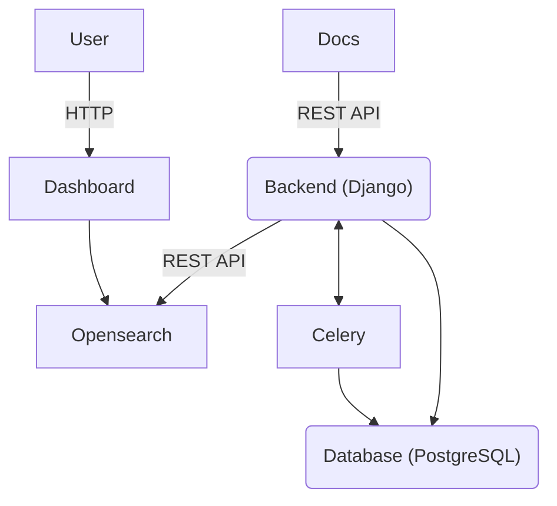

## Architecture

### Global system architecture

```mermaid
flowchart TD
    Docs -- REST API --> Back("Backend (Django)")
    Back --> DB("Database (PostgreSQL)")
    Back -- REST API --> Opensearch
    Back <--> Celery --> DB
    User -- HTTP --> Dashboard --> Opensearch
```
