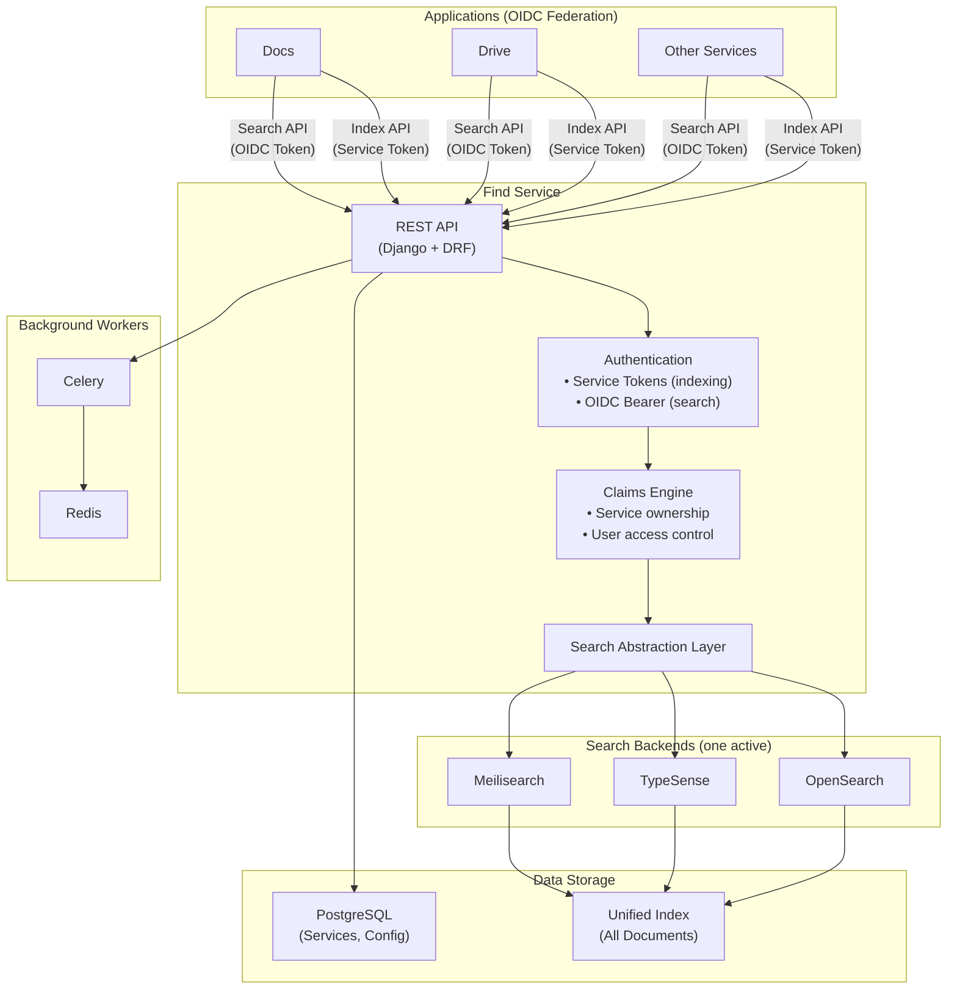
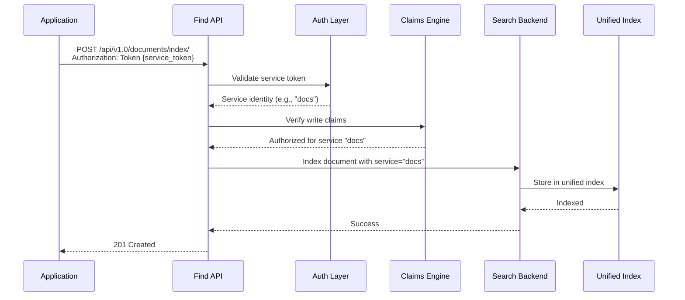
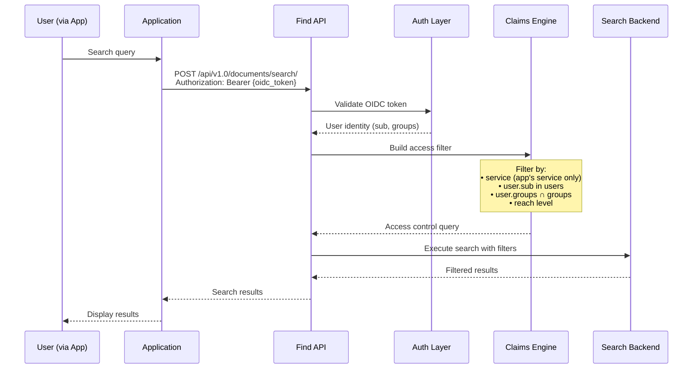

# Architecture

## Overview

Find is a federated document search service that provides a unified search API across multiple applications. It abstracts the underlying search engine, allowing applications to index and search documents without coupling to a specific backend.

## System Architecture



## Data Flow

### Indexing Flow



### Search Flow



## Components

### REST API (Django + DRF)

The API layer handles:

- **Document Indexing**: Single and bulk document indexing
- **Document Search**: Full-text search with filters
- **Document Deletion**: Remove documents by ID or tags
- **Health Checks**: Service availability endpoints

### Authentication Layer

Two authentication modes:

| Mode | Used For | Token Type |
|------|----------|------------|
| **Service Token** | Indexing, Deletion | Static 50-char token |
| **OIDC Bearer** | Search | JWT from OIDC provider |

### Claims Engine

Enforces access control:

- **Service Claims**: Services can only access their own documents
- **User Claims**: Users see documents based on `users`, `groups`, and `reach` fields
- **Query Filtering**: Automatically applies access control to all queries

### Search Abstraction Layer

Backend-agnostic interface supporting:

| Operation | Description |
|-----------|-------------|
| `index()` | Add or update documents |
| `search()` | Full-text search with filters |
| `delete()` | Remove documents |
| `health()` | Backend health check |

### Unified Index

Single index containing all documents:

- **Service isolation**: Documents tagged with source `service`
- **Language support**: French, English, German, Dutch with appropriate analyzers
- **Trigram matching**: Typo-tolerant search via n-gram tokenization

## Deployment Architecture

### Development

```
┌─────────────────────────────────────────────────────────────┐
│                    Docker Compose                            │
│  ┌─────────┐ ┌─────────┐ ┌─────────┐ ┌─────────┐           │
│  │  App    │ │ Celery  │ │ Postgres│ │  Redis  │           │
│  │ :8081   │ │ Worker  │ │ :25432  │ │ :6379   │           │
│  └─────────┘ └─────────┘ └─────────┘ └─────────┘           │
│  ┌───────────────────┐ ┌─────────────────────────┐         │
│  │ Search Backend    │ │ Dashboard (optional)    │         │
│  │ :9200             │ │ :5601                   │         │
│  └───────────────────┘ └─────────────────────────┘         │
└─────────────────────────────────────────────────────────────┘
```

### Production (Kubernetes)

```
┌─────────────────────────────────────────────────────────────┐
│                    Kubernetes Cluster                        │
│  ┌─────────────────────────────────────────────────────┐   │
│  │  Deployment: find-backend (3 replicas)               │   │
│  │  ┌─────────┐ ┌─────────┐ ┌─────────┐               │   │
│  │  │ Pod 1   │ │ Pod 2   │ │ Pod 3   │               │   │
│  │  └─────────┘ └─────────┘ └─────────┘               │   │
│  └─────────────────────────────────────────────────────┘   │
│  ┌─────────────────────────────────────────────────────┐   │
│  │  Deployment: find-celery (2 replicas)                │   │
│  └─────────────────────────────────────────────────────┘   │
│  ┌───────────────┐ ┌───────────────┐ ┌───────────────┐    │
│  │  PostgreSQL   │ │    Redis      │ │Search Backend │    │
│  │  (managed)    │ │  (managed)    │ │  (managed)    │    │
│  └───────────────┘ └───────────────┘ └───────────────┘    │
└─────────────────────────────────────────────────────────────┘
```

## Search Backend Selection

Find supports multiple search backends. Choose based on your requirements:

| Backend | Strengths | Best For |
|---------|-----------|----------|
| **OpenSearch** | Scalability, complex queries, ES compatibility | Large deployments, existing ES expertise |
| **TypeSense** | Speed, typo tolerance, simplicity | Real-time search, smaller datasets |
| **Meilisearch** | Developer experience, fast setup, relevance | Quick deployment, excellent UX |

Backend selection is configured via `SEARCH_BACKEND` environment variable. See [Environment Variables](env.md).

## Security Considerations

### Network Security

- All service-to-service communication over internal network
- Public endpoints behind reverse proxy with TLS
- OIDC provider endpoints accessible for token validation

### Authentication Security

- Service tokens: 50-character cryptographically random strings
- OIDC tokens: RS256/ES256 signed JWTs with audience validation
- No user credentials stored in Find

### Data Security

- Documents filtered at query time (not presentation time)
- Service isolation prevents cross-service data access
- Audit logging for index/delete operations

## Related Documentation

- [Core Concepts](concepts.md) - Unified index, claims, abstraction explained
- [Setup Guide](setup-indexer.md) - Configuration and deployment
- [Environment Variables](env.md) - Complete configuration reference
